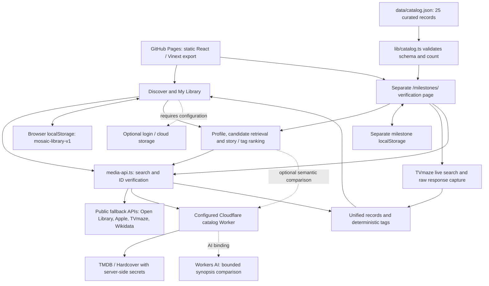

# Mosaic architecture

Source inspection and local verification: September 22–23, 2026. Solid arrows describe implemented paths; dashed arrows are optional/configured services, not proof of active accounts.

The main interface exposes Book, Movie and TV. Games/music retain structured model support but their discovery controls remain hidden. The course catalog is imported from JSON at build time and appears only in the isolated audit page, not the normal library. There is no whole-catalog database server.

The static frontend uses browser storage; `lib/library-storage.ts` validates restoration. Ratings and effective tags feed `lib/recommendations.ts`. Configured secret-bearing requests go through `backend/`; local development without the catalog API URL uses public fallbacks. `.github/workflows/pages.yml` supplies deployment variables. Supabase code does not establish an operational shared ratings database. AI is bounded semantic comparison, not automatic taxonomy generation.

Inspected implementation: `app/page.tsx`, `components/media/add-media.tsx`, `lib/media-api.ts`, `lib/library-storage.ts`, `lib/recommendations.ts`, `backend/`, `next.config.ts`, `.github/workflows/pages.yml`, and `app/milestones/page.tsx`.
