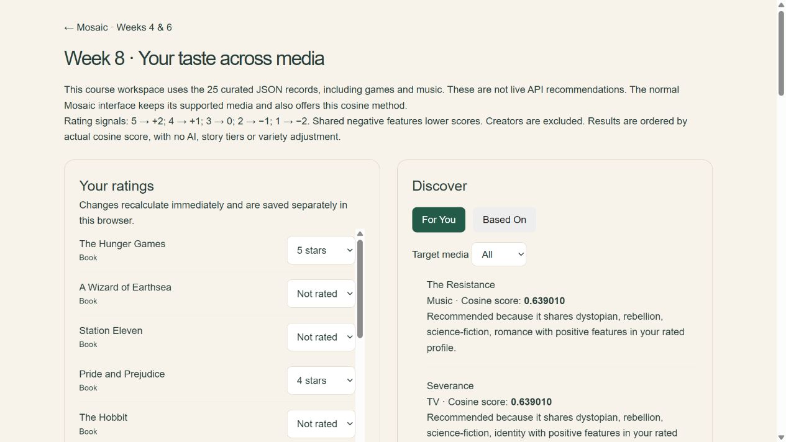
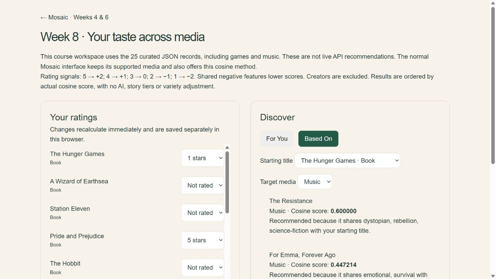
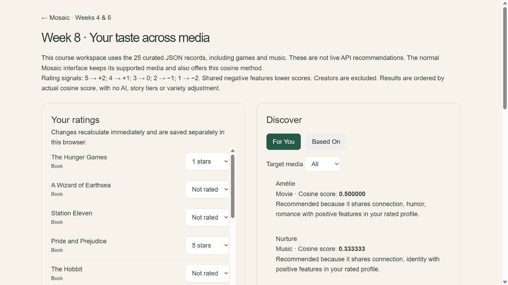

# Week 8: unified signed taste profile and cosine discovery

Implemented September 25, 2026. This milestone demonstrates content-based personalization, not measured recommendation accuracy or full live support for every provider.

## What changed

Before this work Mosaic had weighted tag cosine, but its profile treated 3 stars as positive and its displayed order could be changed by story tiers, AI, providers, preferences and diversity. Those methods remain available. **Week 8: signed taste profile + pure cosine** is a separate explicit method in Advanced matching for both main discovery modes. The course page `/week8/` uses that same algorithm against all 25 structured JSON records.

`lib/cosine-discovery.ts` provides the shared implementation. It unions genres, themes, moods, keywords and legacy tags, normalizes Unicode/case/spacing, removes duplicates, and sorts the vocabulary alphabetically. A feature present in several fields counts once. Creators and media type are not scoring features. Custom/unknown labels present in records join the vocabulary; labels outside a frozen vocabulary contribute zero. No title or example has a ranking exception.

Every item is a binary vector in exactly that vocabulary order. The For You query is the sum of each rated item's vector multiplied by **rating minus 3**: 5→+2, 4→+1, 3→0, 2→−1, 1→−2. Raw sums make profile changes inspectable. Cosine normalizes their magnitude; changing the only positive rating from 5 to 4 changes the vector but not its direction, so it need not change the order. Changing relative ratings across different favorites can change the order.

Based On uses one item's binary vector. Both modes use the same vectorizer, dot product, norms, exclusion and sort code:

`score = dot(query, candidate) / (norm(query) * norm(candidate))`

Zero norms return zero. Mismatched dimensions and non-finite numbers are rejected. All candidate scores (including zero/negative) are retained in evidence; only positive results are shown. Nonpositive/cancelled profiles get guidance, not fabricated results. Negative signals subtract shared features, not entire media types. A low rating may reflect reasons unrelated to every tag; that is a limitation of this simple content-based model.

Already-rated titles and all supplied library items are excluded, including recognized duplicate works. Candidates are deduplicated by the existing identity rules. Ties break by ID for reproducibility. Category filtering preserves the original computed scores and relative order. Positive explanation features and negative contributions come directly from the dot product.

## Main interface versus course demonstration

- Main Discover → Advanced matching → Week 8 method works in For You and Based On. It shows numeric cosine scores and does not use AI, story-tier reranking, Prefer boosts, diversity or series grouping. Explicit content/genre exclusions and Require choices remain eligibility filters. Provider retrieval is still bounded and genre/context-oriented; the algorithm ranks only retrieved candidates. Main category changes initiate retrieval, whereas the fixed course catalog can filter immediately.
- `/week8/` is an isolated, clearly labelled course workspace with all five media types. Games/music are curated records here, not newly activated live services. Ratings persist under `mosaic-week8-v1`, separate from the normal library. The page starts without default ratings or automatic personalized suggestions.
- Both interfaces call `cosineDiscovery`; the course page is not a manually ordered recommendation list. The normal default remains the existing story-oriented method.

## Working evidence

See [algorithm-evidence.json](../evidence/week8/algorithm-evidence.json). It contains the exact vocabulary, Hunger Games vector, profile vector, all unseen candidate scores/contributions, final order, a mixed-media profile and book-to-music results.

Recorded examples from the unchanged curated catalog:

| Scenario | Leading results |
| --- | --- |
| Hunger Games 5; Pride and Prejudice 4 | The Resistance (Music) 0.639010; Severance (TV) 0.639010; Arcane (TV) 0.510310 |
| Change Hunger Games to 1; Pride and Prejudice to 5 | Amélie (Movie) 0.500000; Nurture (Music) 0.333333; Stardew Valley (Game) 0.333333 |
| Based On Hunger Games → Music | The Resistance 0.600000; For Emma, Forever Ago 0.447214; folklore and Melodrama 0.223607 |
| Hunger Games 5, Interstellar 4, Stranger Things 5 | Results span Game, Music, Book, TV and Movie; rated source titles excluded |

Browser observations: initial course page showed onboarding; rating changes immediately reordered results as above; changed ratings and resulting order survived reload; Based On source and Music filter produced the listed scores. Mixed-media browser DOM is preserved in `evidence/week8/mixed-profile-dom.txt`. Screenshots are actual browser captures, not generated mockups:

Main-interface browser verification also returned 59 live-catalog For You candidates and 55 Book candidates in Based On from a TV source. All displayed scores descended in both cases; see `main-ui-check.json` and `main-based-on-check.json`. This run returned books, not every media type; five-type coverage is demonstrated separately with the course catalog. All 114 tests, typecheck and the Pages export passed (the build retains its large-chunk advisory).







## Reproduce

From the repository with Node 22.13+:

```sh
npm ci
npm run typecheck
npm test
node --experimental-strip-types scripts/verify-week8.mjs
npm run build:pages
npm run dev
```

The evidence command is deterministic apart from the capture timestamp and requires no API credentials. It does not change the catalog to force results. Automated tests cover arithmetic against a known cosine value, signed/neutral ratings, profile and rank changes, exclusions, identity deduplication, fixed vocabulary, unknown/duplicate labels, zero vectors, invalid dimensions, stable sorting, media filters, source changes, explanations and cross-media output. These are algorithm correctness tests, not a relevance study.

1. Open `http://localhost:3000/week8/` in a fresh browser profile. Verify onboarding with no ratings.
2. Rate Hunger Games 5 and Pride and Prejudice 4. Check the first row of the table above. Expand vector evidence or download JSON.
3. Change those ratings to 1 and 5. Confirm Amélie moves to the top; reload and confirm persistence.
4. Select Based On, Hunger Games and Music. Check the four book-to-music scores. Switch to All and verify each music score is unchanged.
5. Select another starting title, such as Pride and Prejudice, and confirm a different order.
6. For mixed-media For You, clear Pride and Prejudice, set Hunger Games 5, Interstellar 4 and Stranger Things 5; choose All. Compare `mixed` in the JSON evidence.
7. In normal Mosaic, add real catalog favorites, choose Week 8 in Advanced matching, and search in either mode. All displayed scores must descend. The retrieved pool can change or be empty; course evidence does not claim five live API workflows.

## Files and next work

New: `lib/cosine-discovery.ts`, `app/week8/page.tsx`, `tests/cosine-discovery.test.mjs`, `scripts/verify-week8.mjs`, this report and `evidence/week8/`. Updated: `app/page.tsx` (both-mode integration), `app/milestones/page.tsx` (course navigation), `PROJECT-BACKLOG.md` (later taxonomy editor request), and README entry point.

The later taxonomy editor is recorded, not implemented. It should edit versioned data with stable IDs, aliases, parents/applicability and mappings; validate duplicates/cycles; preview classification/ranking changes; then publish. Renaming a visible label alone cannot teach provider retrieval or synopsis extraction a new concept.
